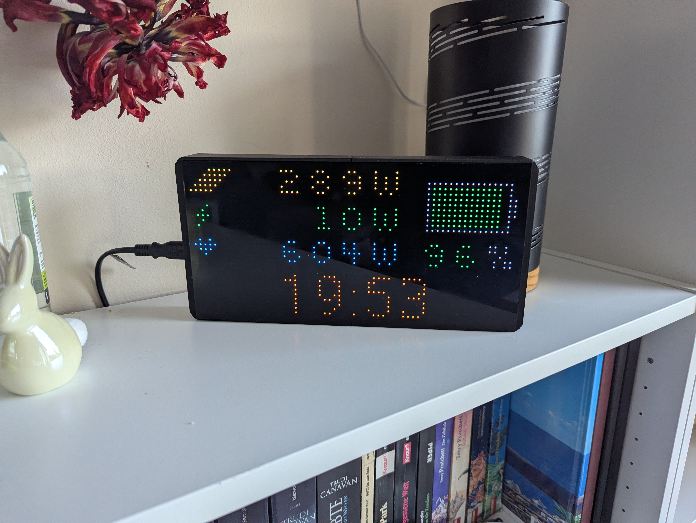

# ESPHome-HUB75-Energy-v2

**Die nächste Generation des [ESP32-HUB75-Display](https://github.com/pazback/ESP32-HUB75-Display) Projekts.**

ESPHome-HUB75-Energy-v2 ist ein hochperformantes Energie-Dashboard für 64x32 RGB-LED-Matrizen. Es basiert auf ESPHome und visualisiert herstellerunabhängig Live-Daten deiner PV-Anlage, deines Speichers und deines Hausverbrauchs direkt aus Home Assistant.

## 🚀 Die Evolution
Dieses Projekt ist die konsequente Weiterentwicklung der ursprünglichen C++ Version. Durch den Wechsel auf **ESPHome** bietet Version 2:
* **Native Home Assistant Integration:** Direkte Kommunikation über die API mit jedem beliebigen Sensor.
* **OTA-Updates:** Drahtlose Konfiguration und Updates ohne USB-Kabel.
* **Optimiertes UI:** Überarbeitete Symbole und eine Farbauswahl, die speziell auf Nachtlesbarkeit ausgelegt ist.

## 📊 Display-Layout & Icons (64x32)
Die Anzeige ist auf maximale Klarheit optimiert. Alle Werte sind rechtsbündig auf **X=42** verankert, während Icons links als visuelle Orientierung dienen.

| Sektion | Icon-Beschreibung | Farbe |
| :--- | :--- | :--- |
| **PV-Leistung** | 5-zeiliges diagonales Fluss-Muster | Gelb |
| **Netz-Leistung** | Blitz-Symbol (Bezug/Einspeisung) | Dynamisch Rot/Grün |
| **Hausverbrauch** | Herz-Symbol (Puls des Hauses) | Cyan |
| **Speicher (SOC)** | Batterie-Block mit Balkenanzeige | Ampel-Logik |
| **Uhrzeit** | Große zentrierte Zeitanzeige | Amber |

## 🎨 Dynamische Farblogik
Um den Energiestatus intuitiv erfassbar zu machen, nutzt das Display eine automatisierte Farbanpassung basierend auf den Sensorwerten:

* **Netz-Status (Grid Power):**
    * **Rot:** Bei Netzbezug (Wert > 0W).
    * **Grün:** Bei Netzeinspeisung (Wert < 0W).
* **Batterie-Speicher (SOC):**
    * **Rot:** < 20% (Warnzustand).
    * **Gelb:** 20% - 49%.
    * **Grün:** >= 50%.
* **Nacht-Optimierung (Amber-Modus):** Die Uhrzeit wird permanent in **Amber (Bernstein)** dargestellt, um "Blooming" (Überstrahlen) zu verhindern und die Nachtruhe nicht zu stören.

## 🛠 Startet euer eigenes Projekt

1. **Software:** Erstellt euch ein neues Projekt in ESPHome, kopiert den Code aus der `led-matrix.yaml` hinein und passt die Entity-IDs euren Sensoren aus Home Assistant an.
2. **Hardware:** Die korrekte Verdrahtung zwischen ESP32 und der Matrix entnehmt ihr einfach dem Vorgänger-Projekt: [ESP32-HUB75-Display Verdrahtung](https://github.com/pazback/ESP32-HUB75-Display).
3. **Gehäuse:** Ein 3D-Druck Gehäuse wie dieses von [Thingiverse (5793070)](https://www.thingiverse.com/thing:5793070) passt perfekt für die 64x32er Panels.
4. **Finish:** Zum Abschluss empfiehlt es sich, eine **schwarz getönte Acrylplatte (ca. 26x13cm)** vor die Matrix zu setzen. Das macht das Licht deutlich weicher, erhöht den Kontrast und sorgt für einen professionellen Look.

## 📜 Lizenz

Dieses Projekt ist für den **privaten Gebrauch** freigegeben.  
Eine **kommerzielle Nutzung** (Verkauf, Integration in Produkte etc.) ist nur nach vorheriger Zustimmung des Autors erlaubt.  

Kontakt für Anfragen bitte über GitHub.

---
**Autor:** [pazback]  
**Vorgänger-Projekt:** [ESP32-HUB75-Display](https://github.com/pazback/ESP32-HUB75-Display)
